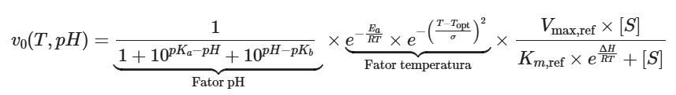
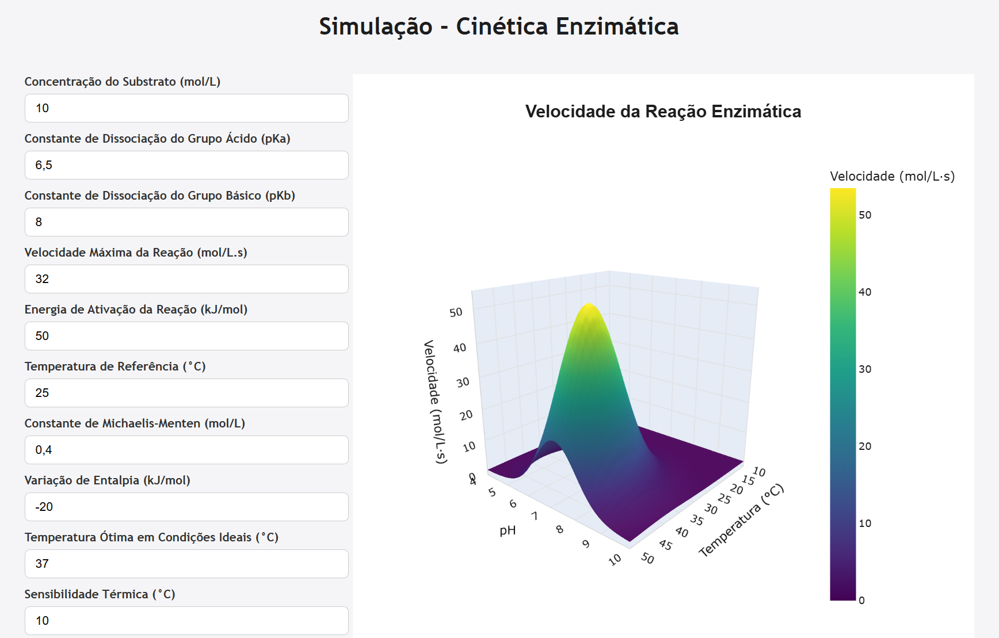

<h1 align="center">Simulação da Cinética Enzimática com Plotly e Dash</h1>
 

## Descrição do Projeto

Este repositório é o projeto final da disciplina Prática em Ciência de Dados, cursada no primeiro semestre do Bacharelado em Ciência e Tecnologia da Ilum Escola de Ciência. O objetivo dessa aplicação é aplicar e aprofundar os conhecimentos adquiridos ao longo do semestre em um projeto prático, apresentado em um simpósio interno na própria instituição, com arguição dos professores responsáveis pela disciplina.

## Objetivo

O principal objetivo deste projeto é explorar o potencial das bibliotecas Plotly e Dash para a criação de uma visualização gráfica interativa. A cinética enzimática foi escolhida como exemplo prático para aplicar essas ferramentas, permitindo manipular parâmetros como concentração do substrato, constantes de ionização, energia de ativação, entre outros. A partir desses parâmetros, é gerado um  gráfico tridimensional da velocidade enzimática, em que os eixos x e y representam a temperatura e o pH , respectivamente, e o eixo z representa a velocidade da reação.

Essa abordagem facilita uma compreensão visual e dinâmica dos fatores que influenciam a atividade enzimática, além de demonstrar as capacidades das bibliotecas para projetos de ciência de dados interativos.

## Índice

1. [Introdução às Bibliotecas](#1-introdução-às-bibliotecas)
   - [1.1. Biblioteca Plotly](#11-biblioteca-plotly)
   - [1.2. Biblioteca Dash](#12-biblioteca-dash)
   - [1.3. Outras Biblitoecas Utilizadas](#13-outras-biblitoecas-utilizadas)
2. [Criação da Função Base](#2-criação-da-função-base)
3. [Implementação do Código](#3-implementação-do-código)
4. [Resultados](#4-resultados)
5. [Conclusão](#5-conclusão)
6. [Contribuições](#6-contribuições)
7. [Licença](#7-licença)

## 1. Introdução às Bibliotecas

Dado que o propósito central deste projeto é explorar o potencial das bibliotecas Plotly e Dash na construção de visualizações interativas, é essencial apresentar brevemente suas principais características e funções. A seguir, explicamos como essas ferramentas, juntamente com outras bibliotecas de suporte, foram aplicadas na criação de uma simulação dinâmica da cinética enzimática, permitindo ao usuário interagir com variáveis experimentais e observar seus efeitos em tempo real.

### 1.1. Biblioteca Plotly

[Plotly](https://plotly.com/python/) é uma biblioteca de visualização gráfica altamente interativa e compatível com notebooks, scripts Python e aplicações web. Ela permite a criação de gráficos em 2D e 3D com grande nível de customização e interatividade.

Neste projeto, usamos `plotly.graph_objects` para construir superfícies tridimensionais que representam como a velocidade da reação enzimática varia com temperatura e pH.

### 1.2. Biblioteca Dash

[Dash](https://dash.plotly.com/) é um framework desenvolvido pelos criadores do Plotly que permite construir interfaces web interativas em Python.

Com o Dash, podemos criar dashboards dinâmicos e interativos em que a visualização de dados é atualizada em tempo real a partir da interação do usuário com controles como sliders, inputs ou menus.

Este é o núcleo funcional da aplicação, servindo como base para a construção da interface web.

### 1.3. Outras Biblitoecas Utilizadas

* [NumPy](https://numpy.org/): biblioteca essencial para cálculos numéricos, especialmente na criação de matrizes e vetores usados para gerar os valores de temperatura e pH que alimentarão a superfície 3D.
* [Math](https://docs.python.org/pt-br/3/library/math.html): biblioteca padrão do Python utilizada para funções matemáticas como exponencial e potência.

## 2. Criação da Função Base

Para tornar possível a construção da visualização gráfica da cinética enzimática, foi necessário implementar uma função matemática que representasse o comportamento da velocidade da reação enzimática em função de certas variáveis. Essa função é baseada em uma extensão da equação clássica de Michaelis-Menten, que descreve a velocidade da reação enzimática considerando a concentração do substrato.

Para tornar a modelagem mais realista, foram incluídos dois fatores importantes:

* **Fator de Temperatura:** incorpora o efeito da energia de ativação (via equação de Arrhenius) e um termo gaussiano que representa a diminuição da atividade quando a temperatura se afasta do valor ótimo.
* **Fator de pH:** modela a dependência da atividade da enzima com o pH, considerando os estados de ionização ácido-base da enzima.

A equação completa que descreve essa função é:

Em particular, o termo $e^{\frac{\Delta H}{R T}}$ representa a dependência da constante de Michaelis-Menten $K_m$ com a temperatura, refletindo mudanças na afinidade da enzima pelo substrato conforme a temperatura varia.

Essa função serve como base computacional para gerar os valores que alimentam os gráficos interativos, permitindo explorar visualmente os efeitos de diferentes condições experimentais sobre a atividade enzimática.

## 3. Implementação do Código

A implementação completa da aplicação encontra-se no arquivo [notebook_simulacao.ipynb](notebook_simulacao.ipynb), que funciona como um guia explicativo passo a passo do desenvolvimento do projeto. Nele, encontra-se todas as informações contidas neste README e, adicionalmente, cada etapa do código, apresentadas com comentários e descrições que facilitam a compreensão do funcionamento da simulação.

Esta seção, no notebook, está dividida nas seguintes seções:

1. **Importação das Bibliotecas** – Carregamento das bibliotecas necessárias para a construção da interface e execução dos cálculos.
2. **Codificação da Função Base** – Implementação da equação da velocidade enzimática na forma de uma função em linguagem de programação.
3. **Construção da Interface** – Definição dos elementos interativos da aplicação usando componentes do Dash.
4. **Callback para Atualização do Gráfico** – Lógica que conecta a entrada do usuário com a atualização dinâmica da visualização.
5. **Execução da Aplicação** – Comando para iniciar o servidor local e visualizar a interface interativa no navegador.

Esse notebook pode ser utilizado como material de apoio para estudos sobre visualização interativa com Dash e aplicações da cinética enzimática em ciência de dados.

## 4. Resultados

A imagem abaixo mostra uma captura de tela da interface desenvolvida:

A seguir, disponibilizamos uma demonstração da aplicação em funcionamento, mostrando como o gráfico interativo responde às alterações nos parâmetros:

https://github.com/user-attachments/assets/bef6813d-7a91-45de-a638-cb5d75507bb5

## 5. Conclusão

Após executar a aplicação e interagir diretamente com os parâmetros da cinética enzimática, fica claro que as bibliotecas como Plotly e Dash são ferramentas poderosas para a construção de aplicações que facilitam a visualização e a exploração de dados. A capacidade de alterar parâmetros em tempo real e observar seus efeitos em um gráfico tridimensional torna essa interface especialmente útil para fins educacionais, apresentações de resultados e análises exploratórias.

Além de facilitar a compreensão de como múltiplos parâmetros interagem, esta aplicação evidencia o potencial do Plotly e do Dash na criação de gráficos interativos com boa usabilidade e alto nível de customização. Essas bibliotecas também oferecem possibilidades para implementações futuras, como integração com bases de dados reais, exportação de resultados e adaptação para diferentes áreas da ciência e tecnologia, ampliando seu uso em projetos diversos.

## 6. Contribuições

**Autores:**

João Gabriel Lima Marengo
Joaquim Junior Ferola Fonseca
Sophia Alves da Silva

**Professores Responsáveis:**

Daniel Roberto Cassar
James Moares de Almeida
Leandro Nascimento Lemos

## 7. Licença

Este projeto está licenciado sob os termos da [GNU General Public License v3.0](LICENSE).
